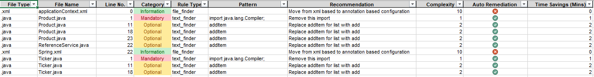

# Discrepancy Finder

## Introduction
*Discrepancy-finder* is a java based tool which takes input as source code  like Java / .NET / other OR config files like Websphere / Weblogic and creates two output files on the basis of specified rules. The two output files created are:
 -  **discrapency-list.xls** - list of all discrepancies found in source files based on rules (and if applicable, corresponding line numbers)
 -  **remediated-{source-file}** - output file with possible fix for discrepancy


## Usage Example

Program takes four arguments

 - **1st arg** - Discrapency rule xml file
 - **2nd arg** - Source / Input location
 - **3rd arg** - Target / Output location
 - **4th arg** - Mode - 0 for find and 1 for find-and-remediate


```sh
##############################################################################
#                                                                            #
#   <rule_file> <source_location> <target_location> <find_remediate_mode>    #
#   example : discrapency-rules.xml C:/input C:/output 0                     #
#                                                                            #
##############################################################################
```

## Sample Output File
 <!-- .element height="100%" width="100%" -->

# More Details

## Benefits 

For tech upgrades in factory model,  this tool should assit in below areas 

 - **Application Insights** - Provide application inventory details like number of files, types of files, files with DB interactions, etc 
 - **Application Complexity** - Output should help in determining application complexity & effort estimations 
 - **Identify Discrapencies** -  Find exact discrapencies in code / config on the basis on rules & provides complexity level for fixes 
 - **Remediation** - Auto-Remediate common discrapencies and save human efforts 
 - **Rule Repository** - Aim is to provide 'Discrepancy Rule Repository' for various tech upgrades like below

| Languages | Frameworks | Application Servers | Databases | Operating Systems |
| --------- | ---------- | ------------------- | --------- | ----------------- |
| Java 6 to 11 | Spring 2.x to 5.0 | Weblogic migrate | Oracle 11 / 12 migrate to PostgreSQL | RHEL 7.0 upgrade |
| Java 7 to 11| Spring 3.x to 5.0 | Websphere migrate | SQL Server 20016 upgrade| |
| Java 8 to 11 | Spring 4.x to 5.0 | Tomcat 9 upgrade| | |
| .NET 2.0  to 4.0| JSP 1.x to 2.0| Apache 2.4 upgrade| | 
| .NET 3.0 to 4.0 | IE 1.8 to IE 11| | |

See  [Rule Repository](https://github.com/jeevanatigre/discrepancy-finder-service/tree/master/rule-repository)


## TODOs

 - Populate 'Discrepancy Rule Repository' for various tech upgrades
 - Cascading impact implementation
 - Integrate with existing platforms / tools
 - Web UI / Eclipse PlugIn / VSCode PlugIn